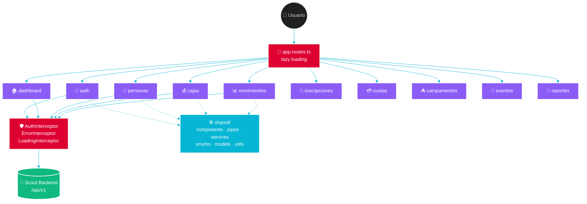

<!-- ══════════════════════════════════════════════════════════════════ -->
<!--                        🌊  HERO BANNER  🌊                         -->
<!-- ══════════════════════════════════════════════════════════════════ -->

<div align="center">


<a href="#scout-frontend--gestión-financiera-para-grupos-scout-con-angular-21">
  
</a>

<br/>

<p>
  
  
  
  
</p>

<p>
  
  
  
  
  
  
</p>

</div>

---

# Scout Frontend — Gestión financiera para grupos scout con Angular 21 🎯

**Scout Frontend** es la aplicación web **Angular 21** de **gestión financiera para grupos scout**: una sola plataforma para administrar el padrón de socios, las cajas contables del grupo y las ramas, los movimientos de ingresos y egresos, las inscripciones anuales a **Scouts de Argentina**, las cuotas mensuales, los campamentos y los eventos de venta y del grupo. Soporta modo oscuro nativo, arquitectura modular con lazy loading y dashboards financieros en tiempo real.

> 📦 **Parte del monorepo [Scout](../README.md)** · Ver también: [🚀 Backend (NestJS)](../backend/README.md) · [🤖 AGENTS.md](../AGENTS.md)

> **Panel financiero y administrativo** para un grupo scout. Una sola app para gestionar socios, cajas, movimientos, inscripciones, cuotas, campamentos y eventos — con dashboards en tiempo real, modo oscuro nativo y arquitectura modular.

<div align="center">


<sub><i>Dashboard principal — modo oscuro con tarjetas de estado financiero</i></sub>

</div>

---

## 📸 Galería

<table>
  <tr>
    <td align="center" width="50%">
      <br/>
      <sub><b>Listado de movimientos</b><br/>Filtros por fecha, caja, persona y concepto</sub>
    </td>
    <td align="center" width="50%">
      <br/>
      <sub><b>Alta de movimiento</b><br/>Validación reactiva con Material + Tailwind</sub>
    </td>
  </tr>
  <tr>
    <td align="center" width="50%">
      <br/>
      <sub><b>Inscripciones</b><br/>Padrón anual a Scouts de Argentina</sub>
    </td>
    <td align="center" width="50%">
      <br/>
      <sub><b>Login</b><br/>Soporte de tema claro / oscuro</sub>
    </td>
  </tr>
</table>

---

## 🧭 Tabla de contenidos

<table>
<tr>
<td valign="top" width="50%">

**Producto**
- [🎯 Qué hace](#-qué-hace-este-proyecto)
- [📸 Galería](#-galería)
- [🧩 Módulos](#-módulos-de-feature)
- [🚀 Instalación](#-instalación)
- [⚡ Comandos](#-comandos)

</td>
<td valign="top" width="50%">

**Ingeniería**
- [🛠 Stack](#-stack-técnico)
- [🏗 Arquitectura](#-arquitectura)
- [🎨 Estilos](#-estilos)
- [🧪 Testing](#-testing)
- [🤖 IA · Skills · Agentes](#-desarrollo-asistido-por-ia)
- [🚢 Deploy](#-deploy)

</td>
</tr>
</table>

---

## 🎯 Qué hace este proyecto

> [!TIP]
> **TL;DR** — Es la UI web que usan educadores y administradores para llevar la plata del grupo scout: quién pagó, qué se gastó, cuánto queda en cada caja, quién se inscribió al campamento y quién a Scouts de Argentina.

<table>
<tr>
<td>

| Feature | Descripción |
|---|---|
| 🏠 **Dashboard** | Estado financiero del grupo de un vistazo |
| 👥 **Personas** | ABM de protagonistas, educadores y externas |
| 💰 **Cajas** | Grupo, ramas y cuentas personales con saldo en tiempo real |
| 📊 **Movimientos** | Ingresos/egresos con 15 conceptos y filtros avanzados |
| 📝 **Inscripciones** | Padrón anual a Scouts de Argentina |
| 💳 **Cuotas** | Cuotas mensuales del grupo |
| ⛺ **Campamentos** | Gestión de participantes y pagos |
| 🎪 **Eventos** | Eventos de venta y de grupo |
| 📑 **Reportes** | Exportables a Excel |
| ⚙️ **Configuración** | Sistema y preferencias |

</td>
</tr>
</table>

> [!NOTE]
> La app soporta **modo claro/oscuro**, es **responsive** y usa **lazy loading por feature** para mantener el bundle inicial bajo.

---

## 🛠 Stack técnico

<div align="center">

<table>
<tr>
<th>Capa</th><th>Tecnología</th><th>Versión</th>
</tr>
<tr><td>🅰️ Framework</td><td>Angular (standalone + functional guards)</td><td></td></tr>
<tr><td>🔷 Lenguaje</td><td>TypeScript (strict)</td><td></td></tr>
<tr><td>🎨 UI Kit</td><td>Angular Material + CDK</td><td></td></tr>
<tr><td>💨 Estilos</td><td>Tailwind CSS</td><td></td></tr>
<tr><td>⚡ Reactivo</td><td>RxJS + Signals</td><td></td></tr>
<tr><td>🧪 Testing</td><td>Jasmine + Karma</td><td></td></tr>
<tr><td>🏗 Build</td><td>Angular CLI</td><td></td></tr>
<tr><td>🚢 Deploy</td><td>Vercel</td><td></td></tr>
</table>

</div>

---

## 🏗 Arquitectura



### 📁 Estructura del `src/app`

```
src/app/
├── 🚀 app.ts                 Root component
├── ⚙️  app.config.ts          Providers + interceptors
├── 🧭 app.routes.ts          Rutas con lazy loading
│
├── 🔐 core/                  Singletons globales
│   ├── guards/               authGuard (functional)
│   └── interceptors/         auth · error · loading
│
├── ♻️  shared/                Reutilizable entre 2+ features
│   ├── components/           UI compartida
│   ├── config/               Configuración de app
│   ├── constants/            Constantes
│   ├── enums/                Enums de dominio
│   ├── forms/                FormGroups reutilizables
│   ├── models/               Interfaces y tipos
│   ├── pipes/                Pipes comunes
│   ├── services/             Servicios compartidos
│   ├── styles/               Utilities de estilo
│   ├── testing/              Helpers y mocks de test
│   ├── utils/                Funciones utilitarias
│   └── validators/           Validators custom
│
├── 🎨 layout/                Shell de la aplicación
│   ├── components/           Sidebar · header · container
│   ├── models/               Interfaces de layout
│   └── services/             Servicios de layout
│
└── 🧩 modules/               Features lazy-loaded
```

> [!IMPORTANT]
> **Regla de oro** — Antes de crear cualquier componente, servicio, enum, validator o util nuevo, revisar `shared/`. Si ya existe algo equivalente, **reusarlo o extenderlo**. Duplicar código en este proyecto no está permitido.

---

## 🧩 Módulos de feature

<div align="center">

| Módulo | Estado | Descripción |
|---|:---:|---|
| `auth` | ✅ | Login y flujo de autenticación JWT |
| `dashboard` | ✅ | Panel principal con KPIs financieros |
| `personas` | ✅ | ABM de Protagonistas, Educadores y Externas |
| `cajas` | ✅ | Caja grupo, fondos rama, cuentas personales |
| `movimientos` | ✅ | Registro y consulta de ingresos / egresos |
| `inscripciones` | ✅ | Inscripciones anuales a Scouts de Argentina |
| `cuotas` | ✅ | Cuotas mensuales del grupo |
| `campamentos` | ✅ | Gestión de campamentos y pagos |
| `eventos` | ✅ | Eventos de venta y del grupo |
| `reportes` | ✅ | Reportes + exportación a Excel |
| `configuracion` | ✅ | Configuración del sistema |
| `velocidades` | 🚧 | Registro de velocidades por ruta *(roadmap)* |

</div>

---

## 🚀 Instalación

<div align="center">

<table>
<tr>
<th width="15%">1️⃣</th>
<th>Instalar</th>
</tr>
<tr>
<td align="center"><kbd>npm</kbd></td>
<td>

```bash
npm install
```

</td>
</tr>
<tr>
<th>2️⃣</th>
<th>Levantar dev server</th>
</tr>
<tr>
<td align="center"><kbd>start</kbd></td>
<td>

```bash
npm start
```

</td>
</tr>
<tr>
<th>3️⃣</th>
<th>Abrir en el navegador</th>
</tr>
<tr>
<td align="center">🌐</td>
<td>

```
http://localhost:4200
```

</td>
</tr>
</table>

</div>

> [!TIP]
> **Shortcut útil** — Presioná <kbd>Ctrl</kbd>+<kbd>C</kbd> en la terminal para detener el dev server. Con <kbd>r</kbd>+<kbd>Enter</kbd> reiniciás la compilación incremental.

> [!NOTE]
> Por defecto apunta al backend desplegado en Railway. Para apuntar a un backend local, editar `src/environments/environment.ts` con `http://localhost:3001/api/v1`.

---

## ⚡ Comandos

| Comando | Descripción | Velocidad |
|---------|-------------|:---------:|
| `npm start` | Dev server en `http://localhost:4200` | 🔥🔥🔥 |
| `npm run build` | Build de producción a `dist/` | 🔥🔥 |
| `npm run watch` | Build incremental en modo dev | 🔥🔥🔥 |
| `npm test` | Unit tests con Karma/Jasmine | 🔥🔥 |
| `npm run ng -- <cmd>` | Angular CLI directo | 🔥 |

<details>
<summary><b>🧰 Ejemplos útiles</b></summary>

```bash
# Generar un componente standalone en un feature
npm run ng -- g c modules/personas/components/persona-form --standalone

# Correr tests con cobertura
npm test -- --code-coverage

# Correr tests de un archivo específico
npm test -- --include='**/personas.service.spec.ts'

# Build + análisis de bundle
npm run build -- --stats-json
```

</details>

---

## 🎨 Estilos

**Tailwind CSS 4 + Angular Material 21** — utilities para layout, componentes Material para interacción.

> [!TIP]
> **✅ Recomendado**
> ```html
> <div class="flex items-center gap-4 p-6 rounded-lg bg-blue-600">
>   <p class="text-lg font-semibold text-white">Dashboard</p>
> </div>
> ```

> [!CAUTION]
> **❌ Evitar estilos inline y valores arbitrarios**
> ```html
> <div style="display: flex; gap: 1rem;">…</div>
> <div class="text-[24px]">…</div>
> ```

---

## 🧪 Testing

```bash
npm test                      # Suite completa
npm test -- --code-coverage   # Con cobertura
npm test -- --watch           # Watch mode
```

<details>
<summary><b>📝 Ejemplo de unit test</b></summary>

```typescript
import { TestBed, ComponentFixture } from '@angular/core/testing';
import { DashboardComponent } from './dashboard.component';

describe('DashboardComponent', () => {
  let component: DashboardComponent;
  let fixture: ComponentFixture<DashboardComponent>;

  beforeEach(async () => {
    await TestBed.configureTestingModule({
      imports: [DashboardComponent],
    }).compileComponents();

    fixture = TestBed.createComponent(DashboardComponent);
    component = fixture.componentInstance;
    fixture.detectChanges();
  });

  it('should create', () => {
    expect(component).toBeTruthy();
  });
});
```

</details>

> [!WARNING]
> **No olvides el cleanup** — toda subscripción debe usar `takeUntilDestroyed()` o desuscribirse en `ngOnDestroy`. Las memory leaks en Angular son silenciosas hasta que no lo son.

---

## 🤖 Desarrollo asistido por IA

<div align="center">


</div>

> [!IMPORTANT]
> Este proyecto está **optimizado para Claude Code**. Skills, agentes y comandos actúan como una capa de "senior engineer" que impone patrones antes de generar código.

### 🧠 Skills del proyecto

<table>
<tr>
<th>Skill</th><th>Dispara en</th><th>Qué aporta</th>
</tr>
<tr><td><code>typescript</code></td><td>Tipos, interfaces, DTOs</td><td><code>const</code> types, sin <code>any</code></td></tr>
<tr><td><code>commit</code></td><td>Crear un git commit</td><td>Conventional commits con scopes válidos</td></tr>
<tr><td><code>changelog</code></td><td>Cerrar feature o abrir PR</td><td>Formato keepachangelog.com</td></tr>
<tr><td><code>docs</code></td><td>Escribir README o guías</td><td>Guía de estilo y tono</td></tr>
</table>

### 🎨 Skills de UI (plugins globales)

| Skill | Uso |
|-------|-----|
| 🎨 `frontend-design` | Interfaces production-grade con jerarquía visual |
| 💅 `ui-styling` | Componer UI con Material + Tailwind |
| 🎨 `tailwind-design-system` | Tokens, scales de spacing, tipografía |
| ♿ `web-design-guidelines` | Review de accesibilidad y UX |
| 🧹 `style-deduplicator` | Detecta CSS duplicado y propone tokens |
| 🎭 `webapp-testing` | Debug con Playwright sobre la app local |

### 🤖 Agentes especializados

| Agente | Uso |
|--------|-----|
| 🏗 `feature-dev:code-architect` | Diseña arquitectura analizando patrones existentes |
| 🔍 `feature-dev:code-explorer` | Mapea capas y dependencias antes de tocar código |
| 👀 `feature-dev:code-reviewer` | Review con filtrado por confianza |
| 🧪 `tdd-guide` | Fuerza TDD con objetivo de 80% de cobertura |
| 🎭 `e2e-runner` | Tests E2E con Playwright |
| 🧹 `refactor-cleaner` | Detecta dead code (`knip`, `depcheck`, `ts-prune`) |
| 🔨 `build-error-resolver` | Resuelve errores de build con diffs mínimos |
| 🔒 `security-reviewer` | XSS, secrets, CSRF, OWASP Top 10 |
| ✨ `impeccable:audit` | Audit de accesibilidad, responsive y performance |
| 💎 `impeccable:polish` | Pase final de pulido: alineación, spacing |

### ⚡ Comandos útiles

<table>
<tr>
<th>Comando</th><th>Efecto</th>
</tr>
<tr><td><code>/commit</code></td><td>Commit con conventional-commits</td></tr>
<tr><td><code>/commit-push-pr</code></td><td>Commit + push + PR con descripción generada</td></tr>
<tr><td><code>/plan</code></td><td>Plan paso a paso antes de tocar código</td></tr>
<tr><td><code>/tdd</code></td><td>Ciclo RED → GREEN → REFACTOR</td></tr>
<tr><td><code>/review-pr</code></td><td>Review con subagentes en paralelo</td></tr>
<tr><td><code>/e2e</code></td><td>Genera y ejecuta tests E2E con Playwright</td></tr>
<tr><td><code>/security-review</code></td><td>Audit de seguridad de los cambios pendientes</td></tr>
<tr><td><code>/save-session</code> · <code>/resume-session</code></td><td>Persistencia de contexto entre sesiones</td></tr>
</table>

### 🔌 Plugins habilitados

<div align="center">


</div>

- **superpowers** — brainstorming, plans, TDD, debugging sistemático
- **feature-dev** — arquitecto + explorador + reviewer
- **impeccable** — audit, polish, animate, harden, clarify, distill
- **frontend-design** — interfaces production-grade
- **pr-review-toolkit** — review con subagentes paralelos
- **everything-claude-code** — planner, tdd-guide, e2e-runner, security-reviewer
- **hookify** — hooks de Pre/PostToolUse

### 🪝 Hooks automáticos

> [!TIP]
> **PostToolUse** → Prettier sobre cada `.ts`/`.html`/`.scss` + `tsc --noEmit` incremental
>
> **Stop** → audita `console.log` olvidados antes de cerrar la sesión

---

## 📐 Convenciones

### Naming

| Artefacto | Convención | Ejemplo |
|-----------|-----------|---------|
| 🅰️ Componente | PascalCase + `Component` | `PersonaFormComponent` |
| 🏷 Selector | kebab-case con `app-` | `<app-persona-form>` |
| 🛠 Servicio | PascalCase + `Service` | `PersonasService` |
| 🔧 Pipe | PascalCase + `Pipe` | `MonedaPipe` |
| 📁 Archivo | kebab-case | `persona-form.component.ts` |

### Commits

`<tipo>[scope]: <descripción>`

**Tipos:** `feat` · `fix` · `docs` · `chore` · `perf` · `refactor` · `style` · `test`

**Scopes:** `personas` · `cajas` · `movimientos` · `inscripciones` · `cuotas` · `campamentos` · `eventos` · `dashboard` · `reportes` · `configuracion` · `shared` · `core` · `layout` · `auth` · `styles`

### ✅ Checklist antes de abrir un PR

- [ ] `npm test` pasa
- [ ] `npm run build` compila sin errores
- [ ] Verificado manualmente en el navegador (golden path + edge cases)
- [ ] Sin `console.log` ni código muerto
- [ ] Changelog actualizado si aplica

---

## 🚢 Deploy

<div align="center">

[](https://vercel.com)

</div>

El frontend se despliega en **Vercel** (ver `vercel.json`). Cada push a la rama principal dispara un build productivo.

```bash
npm run build
# El artefacto queda en dist/frontend/
```

---

## 📂 Archivos relevantes

| Archivo | Propósito |
|---------|-----------|
| `src/main.ts` | Bootstrap de la aplicación |
| `src/app/app.ts` | Componente raíz |
| `src/app/app.config.ts` | Providers, interceptors, router config |
| `src/app/app.routes.ts` | Rutas con lazy loading |
| `src/environments/environment.ts` | URL de la API por entorno |
| `angular.json` | Configuración del Angular CLI |
| `tsconfig.json` | Configuración de TypeScript |
| `vercel.json` | Configuración de deploy en Vercel |

---

<div align="center">

### 💙 Hecho con Angular, Tailwind y Claude Code

<sub>Uso interno del grupo scout · Sistema de gestión financiera</sub>


</div>
